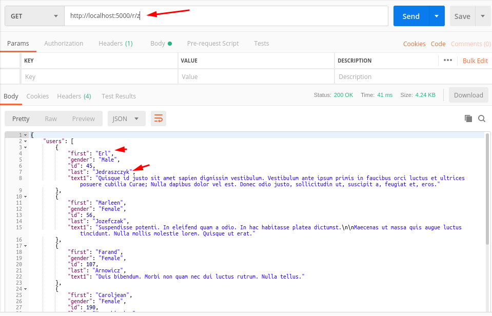
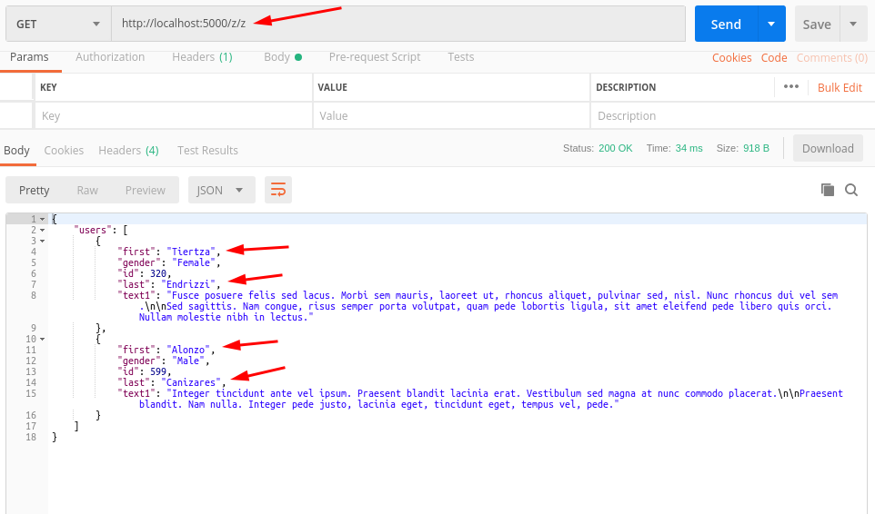

## Minium Code Template To Create API's From A Database Using Flask
___
This is a template of minimal code to fire up and turn a database into a RESTfu API.
* This includes a database of some mock data. If you want to create an api from a csv file check out my other repo on how to convert csv to database.
* The images below show what you should see using Postman by sending GET requests to the dynamic URLs.
___

